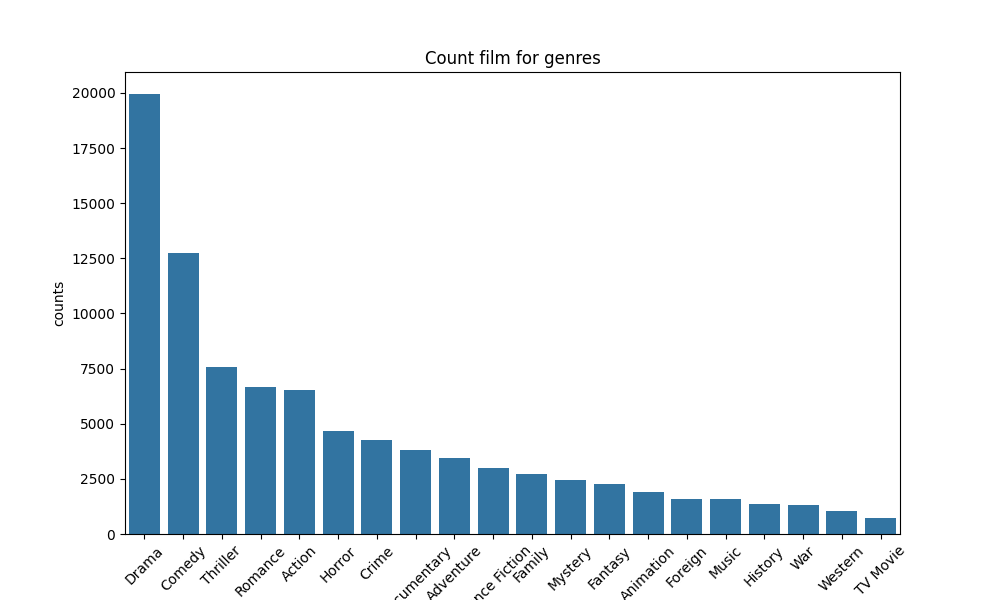

📊 Аналітичний звіт: Аналіз жанрів у наборі даних про фільми
🎯 Мета роботи

Провести попередню обробку метаданих фільмів і визначити розподіл фільмів за жанрами для візуальної оцінки популярності жанрових напрямків у кіноіндустрії.

📌 Використані дані

До аналізу було залучено набір movies_metadata (поля: tagline, homepage, belongs_to_collection, genres).

Виконано очищення даних:
заповнення пропусків у ключових полях
перетворення жанрів з текстового JSON-формату у списки
видалення рядків з непридатними для аналізу значеннями

🔍 Ключові результати

Створено структурований список жанрів для кожного фільму
Виконано підрахунок частоти появи жанрів у всій колекції
Визначено найбільш поширені жанри
(топові позиції очікувано займають Drama, Comedy, Action тощо — відповідно до обчисленого рейтингу)

📈 Візуалізація результатів

Цей графік дозволяє швидко оцінити домінування певних жанрових напрямків.

⚠️ Обмеження аналізу

Видалення всіх пропусків скорочує обсяг досліджуваних даних
Фільми з декількома жанрами враховуються кілька разів (по кожному жанру)
Можливі неточності при розборі жанрового JSON-формату
Візуалізація може втрачати читабельність при великій кількості жанрів

📝 Висновок

Аналіз забезпечує чітке уявлення про жанрову структуру кінематографа в наборі даних та закладає основу для подальших досліджень — наприклад, аналіз за роками, рейтингами або студіями.
